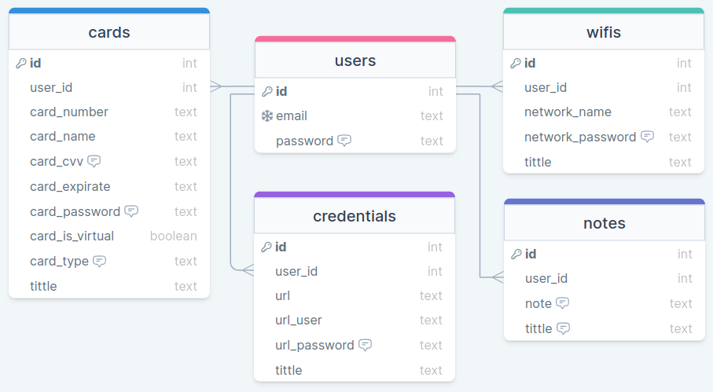

<!-- PROJECT LOGO -->
<br />
<div align="center">
  <a href="https://github.com/kirodoras/pass">
    
  </a>

<!-- Link to src -->
  <h3 align="center">Pass API</h3>
  <p>
    Back end Development Project
    <br />
    <a href="https://github.com/kirodoras/pass/tree/main/src"><strong>Browse TypeScript code</strong></a>
</div>

<!-- Built With -->
<div align="center">
  <h3>Built With</h3>
  
   
  
  
  
    
  
  
</div>

<!-- Table of Contents -->
# Table of Contents

- [Description](#description)
- [Getting Started](#getting-started)
- [Draw SQL](#draw-sql)
- [Routes](#routes)
  - [Users](#users)
  - [Notes](#notes)
  - [Wifis](#wifis)
  - [Credentials](#credentials)
  - [Cards](#cards)
- [Contact](#contact)

<!-- Description -->
# Description

How are we going to memorize gigantic, semantically meaningless passwords? It is to solve this pain that password managers emerged! With them, we only create a “master” password and all other passwords are kept secret! So when we need it, just remember the “master” password!

This project is a password manager API.

<!-- Getting Started -->

# Getting Started

This Api can be used in two different ways: by cloning the project or by using your preferred client, such as [Insomnia](https://insomnia.rest/) or [Postman](https://www.getpostman.com/).

To clone the project, run the following command:

```git
git clone https://github.com/kirodoras/pass
```

Then, navigate to the project folder and run the following command:

```git
npm i -y
```

Finally, start the server:

```git
npm run dev
```

You can now access the API's endpoints by navigating to `http://localhost:5008/` or to the deployed URL `https://app-pass-api.herokuapp.com/`.

<!-- API Reference -->
# Draw SQL

<div align="center">
  
</div>

<!-- Routes -->
# Routes

## [Users](#users) _`/users`_

- [Sign Up](#sign-up) `/signup`
- [Sign In](#sign-in) `/signin`

## [Notes](#notes) _`/notes`_

- [Create a note](#create-a-note) `/create`
- [Search all notes](#search-all-notes) `/search`
- [Search a note](#search-a-note) `/search/:id`
- [Delete a note](#delete-a-note) `/delete/:id`

## [Wifis](#wifis) _`/wifis`_

- [Create a network](#create-a-network) `/create`
- [Search all networks](#search-all-networks) `/search`
- [Search a network](#search-a-network) `/search/:id`
- [Delete a network](#delete-a-network) `/delete/:id`

## [Credentials](#credentials) _`/credentials`_

- [Create a credential](#create-a-credential) `/create`
- [Search all credentials](#search-all-credentials) `/search`
- [Search a credential](#search-a-credential) `/search/:id`
- [Delete a credential](#delete-a-credential) `/delete/:id`

## [Cards](#cards) _`/cards`_

- [Create a card](#create-a-card) `/create`
- [Search all cards](#search-all-cards) `/search`
- [Search a card](#search-a-card) `/search/:id`
- [Delete a card](#delete-a-card) `/delete/:id`

<!-- Routes infos -->
# Users
## Sign Up
```yml
POST users/signup
    - headers: {}
    - body:{
      "email": "test0@test.com",
      "password": "0123456789"	
    }
```
## Sign In
```yml
POST users/signin
    - headers: {}
    - body:{
      "email": "test0@test.com",
      "password": "0123456789"	
    }
```

# Notes

## Create a note
```yml
POST notes/create
    - headers: {
      "Authorization": Bearer [JWT-TOKEN]
    }
    - body:{
      "note": "My note",
      "tittle": "My tittle"
    }
```

## Search all notes
```yml
GET notes/search
    - headers: {
      "Authorization": Bearer [JWT-TOKEN]
    }
    - body:{
    }
```

## Search a note
```yml
GET notes/search/:id
    - headers: {
      "Authorization": Bearer [JWT-TOKEN]
    }
    - body:{
    }
```

## Delete a note
```yml
DELETE notes/delete/:id
    - headers: {
      "Authorization": Bearer [JWT-TOKEN]
    }
    - body:{
    }
```

# Wifis

## Create a network
```yml
POST wifis/create
    - headers: {
      "Authorization": Bearer [JWT-TOKEN]
    }
    - body:{
      "network_name": "GVTXXXX",
      "network_password": "1234",
      "tittle": "My WIFI"
    }
```

## Search all networks
```yml
GET wifis/search/
    - headers: {
      "Authorization": Bearer [JWT-TOKEN]
    }
    - body:{
    }
```

## Search a network
```yml
GET wifis/search/:id
    - headers: {
      "Authorization": Bearer [JWT-TOKEN]
    }
    - body:{
    }
```

## Delete a network
```yml
DELETE wifis/delete/:id
    - headers: {
      "Authorization": Bearer [JWT-TOKEN]
    }
    - body:{
    }
```

# Credentials

## Create a credential
```yml
POST credentials/create
    - headers: {
      "Authorization": Bearer [JWT-TOKEN]
    }
    - body:{
      "url": "https://www.youtube.com/",
      "url_user": "UseR",
      "url_password": "password",
      "tittle": "My Tittle"
    }
```
## Search all credentials
```yml
GET credentials/search
    - headers: {
      "Authorization": Bearer [JWT-TOKEN]
    }
    - body:{
    }
```

## Search a credential
```yml
GET credentials/search/:id
    - headers: {
      "Authorization": Bearer [JWT-TOKEN]
    }
    - body:{
    }
```

## Delete a credential
```yml
DELETE credentials/delete/:id
    - headers: {
      "Authorization": Bearer [JWT-TOKEN]
    }
    - body:{
    }
```
# Cards

## Create a card
```yml
POST cards/create
    - headers: {
      "Authorization": Bearer [JWT-TOKEN]
    }
    - body:{
      "card_number": "5000400030001000",
      "card_name": "João Santos",
      "card_cvv": "321",
      "card_expirate": "12/99",
      "card_password": "1234",
      "card_is_virtual": false,
      "card_type": "BOTH",
      "tittle": "Driven Bank"
    }
```
## Search all cards
```yml
GET cards/search
    - headers: {
      "Authorization": Bearer [JWT-TOKEN]
    }
    - body:{
    }
```
## Search a card
```yml
GET cards/search/:id
    - headers: {
      "Authorization": Bearer [JWT-TOKEN]
    }
    - body:{
    }
```
## Delete a card
```yml
DELETE cards/delete/:id
    - headers: {
      "Authorization": Bearer [JWT-TOKEN]
    }
    - body:{
    }
```

<!-- Contact -->

# Contact

[![LinkedIn][linkedin-shield]][linkedin-url]

<!-- MARKDOWN LINKS & IMAGES -->

[linkedin-shield]: https://img.shields.io/badge/-LinkedIn-black.svg?style=for-the-badge&logo=linkedin&colorB=blue
[linkedin-url]: https://www.linkedin.com/in/mateus-figueiredo-pereira/
